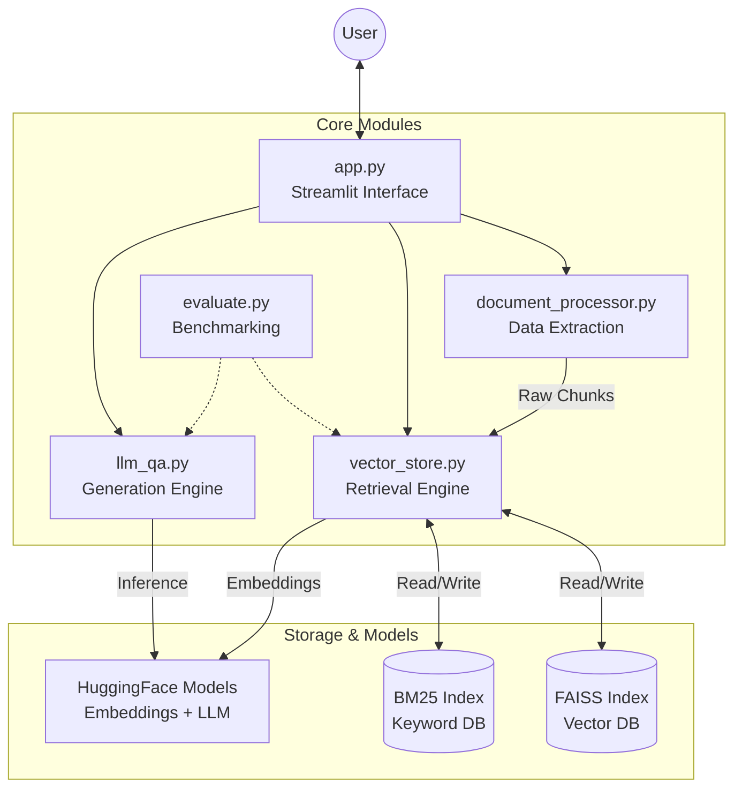
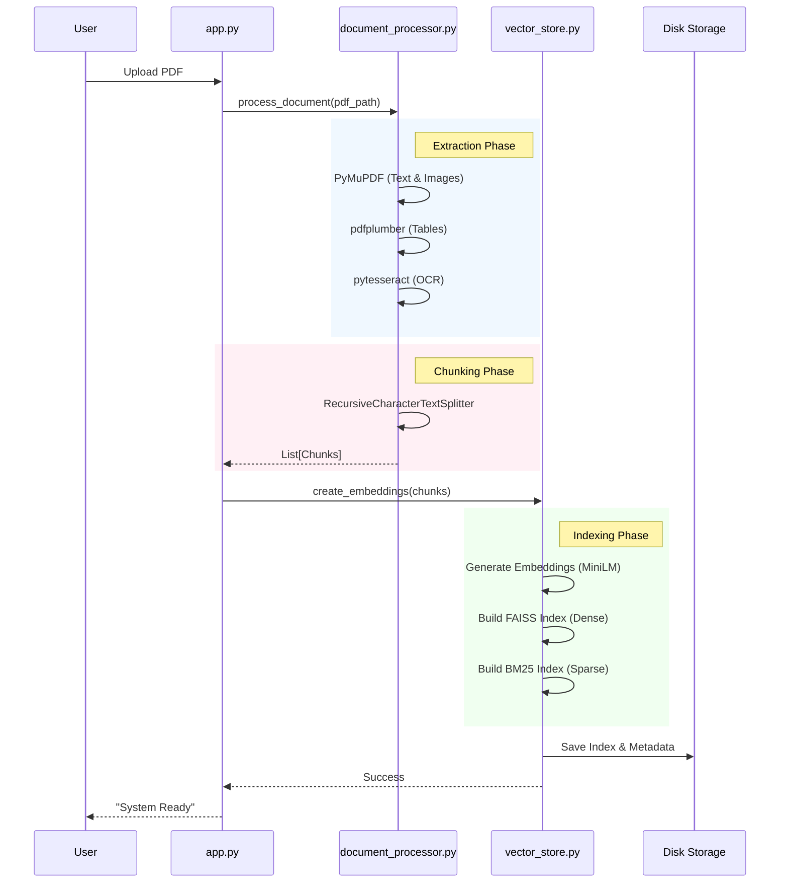
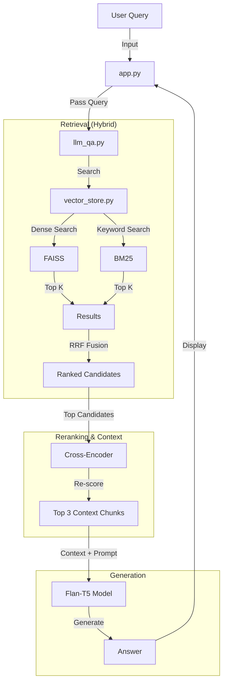

# Multi-Modal RAG System Architecture

## 1. High-Level Component Interaction
This diagram shows how the Python files interact with each other and the external libraries.

## 2. Data Ingestion Pipeline
How a PDF document is processed into searchable vectors.

## 3. Query & Retrieval Flow (RAG)
How the system answers a user question.

