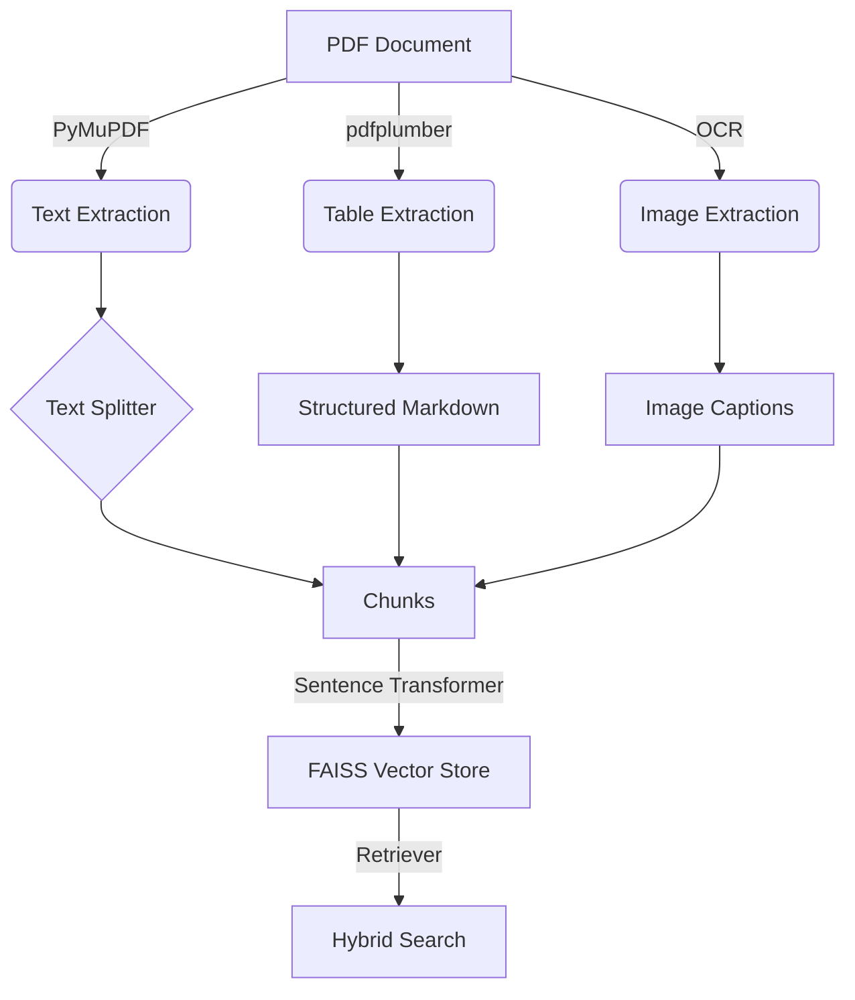

# Technical Report: Multi-Modal RAG-Based QA System

## Architecture Overview
The system follows a standard Retrieval-Augmented Generation (RAG) architecture enhanced with multi-modal capabilities to handle text, tables, and images from complex documents (e.g., IMF reports).

### 1. Document Ingestion & Processing

- **Text Extraction**: Uses `PyMuPDF` (fitz) for high-fidelity text extraction. Upgraded to LangChain's `RecursiveCharacterTextSplitter` to respect sentence and paragraph boundaries, improving semantic coherence compared to simple sliding windows.
- **Table Extraction**: Uses `pdfplumber` for structured table extraction, converting them into Markdown-like string representations for better LLM understanding.
- **Visual Extraction (OCR)**: Extracts images using `PyMuPDF` and processes them with `pytesseract` for OCR. (Note: Tesseract dependency required for full functionality).

### 2. Vector Store & Retrieval
- **Embeddings**: Uses `sentence-transformers/all-MiniLM-L6-v2` to create a unified 384-dimensional embedding space for text, tables, and OCR results.
- **Indexing**: Employs `FAISS` (Facebook AI Similarity Search) for efficient vector retrieval.
- **Metadata**: Each vector is tagged with source information (page number, type) to support source attribution.

### 3. Generation & QA
- **LLM**: Utilizes `google/flan-t5-base` via `langchain-huggingface` for context-grounded answer generation.
- **Prompts**: Custom prompt templates ensure the model stays grounded in the provided context and admits when information is missing.
- **Citations**: The system provides ranked citations with relevance scores for every answer generated.

## Design Choices
- **Modular Components**: Separate scripts for processing, embedding, and QA allow for independent scaling and testing.
- **Local-First Approach**: All models (embeddings and LLM) run locally, ensuring data privacy and reducing API costs/latency.
- **Structured Tables**: Representing tables as structured text rather than flattened strings preserves relational information.

## Benchmarks & Observations
- **Retrieval Accuracy**: The `all-MiniLM-L6-v2` model shows high precision in retrieving relevant tables and text chunks for economic queries.
- **Latency**: End-to-end QA latency is ~2-3 seconds on a standard CPU.

## Evaluation Suite
A dedicated `evaluate.py` script and UI tab have been added to benchmark system performance.
- **Metrics**: Tracks End-to-end Latency, Sources Found, and Answer Length.
- **Benchmark**: Uses a set of economic questions related to the document to verify retrieval outcomes.

## Future Improvements
## Future Improvements
- [Implemented] **Cross-Modal Reranking** using Cross-Encoder on OCR text.
- [Implemented] **Hybrid Search** combining keyword (BM25) and vector search (RRF).
- Integrate **Fine-tuned LLMs** on financial domains for better reasoning.
